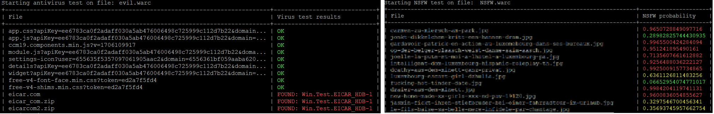

# Introduction

This is a Python program that scans ARC/WARC (web archive) files for viruses and NSFW (not-safe-for-work) content:

  - It detects viruses using the Linux `clamd` antivirus daemon,
  - It detects violence/nudity using an AI model.
  
You can either run it in test mode (check an individual WARC file) or in server mode (for easy integration into existing workflows) when the server has access to the WARC files via file system.

The program accepts both compressed and uncompressed WARC files and the AI NSFW model is able to work with TIFF, JPEG, PNG, SVG and WEBP formats (although images with exotic dimensions/formats might not fully work).

Since June 2026, `warc-safe` is compatible with the Solr field enrichment feature of the [warc-indexer](https://github.com/netarchivesuite/warc-indexer). This means that you can add virus and NSFW information to your Solr index with a minimal configuration of the indexer.

# Installation

Please use Python 3.9+. You can install the requirements as usual:

    pip install -r requirements.txt
    
If you want to use the antivirus feature, you will need to install the `clamd` antivirus daemon. On Ubuntu, you can do so like this:

    apt-get install clamav clamav-daemon -y
    
The first setup of `clamd` requires you to stop, update and start the service:

    systemctl stop clamav-freshclam
    freshclam
    systemctl start clamav-freshclam


# Usage

The tool scan be used in two ways:

  - test mode: scan a single warc on the command-line
  - server mode: use the REST API to scan WARC files programmatically
  
Note that the first time, the application will automatically download the classifier model to the current user's home folder. This might take a few seconds (or minutes) depending on your connection. You can check the progress in stdout.

## Test mode
    
You can start the application in test mode from the command-line as follows:

    python app.py --test-av </path/to/warc>
    python app.py --test-nsfw </path/to/warc>

The first example above runs the antivirus scan and the second the NSFW classifier.



### Scanning a single record

If you want to scan a single record in a WARC file, starting at a specific offset, you can use the `--offset` parameter. An example is shown below.

        python app.py --test-nsfw </path/to/warc> --offset 12345


## Server mode

You can start the application as a server like so:

    python app.py --server <port>

The application in server mode exposes the following endpoints:

  - `test_nsfw`: tests only for NSFW material,
  - `test_antivirus`: tests only for viruses,
  - `test_all`: tests for both of the above.

All these endpoints are POST and take a single argument, `file_path`, which is the absolute path to the WARC that you want to analyze (it can be compressed or uncompressed).

Here is an example request with `curl`:

    curl -X POST -H "Content-Type: application/json" -d '{"file_path": "/my/path/my.warc.gz"}' localhost:8123/test_all

## Return values

All endpoints return JSON. The root element is `results`, which is a list containing the WARC records together with their filter results. Each entry in the list is identified by its `WARC-Record-ID`. Here is an example:

````
{
  "results": {
    "<urn:uuid:ec2aa5f2-391e-530a-a9ed-b44f944fdcb9>": {
      "av_details": null,
      "is_virus": false,
      "filename": "picture.jpg",
      "mime": "image/jpeg",
      "is_nsfw": true,
      "nsfw_score": 0.75693745957662754
    },
    ...
    }
}
````

The fields available for each record are the following:
  - File name: `filename`,
  - Mime type: `mime`,
  - Antivirus: `av_details` and `is_virus`,
  - NSFW: `nsfw_score` and `is_nsfw`,
  - Errors: `err`.

Note that if there were any errors while processing a record, the JSON result will be of the form:

````
{
    "error": "error message"
}
````

## Scanning a single record

As with the command-line version above, you can scan a single WARC record by setting the `offset` parameter. An example is shown below.

    curl -X POST -H "Content-Type: application/json" -d '{"file_path": "/my/path/my.warc.gz", "offset"=12345}' localhost:8123/test_all

Here you will get a JSON object returned, instead of an array like before. Here is an example of a response from the request above.

    {"av_details":null,"is_virus":false,"filename":"picture.jpg","mime":"image/jpeg","is_nsfw":true,"nsfw_score":0.9612351721064546}

Note that if the content you are scanning is not a picture, and the content type is not supported by ClamAV, then you will simply get the response:

    {}


## NSFW scoring

The `nsfw_score` is a floating-point value between 0 (not NSFW at all) and 1 (certainly NSFW). On the other hand, the `is_nsfw` field if `true` if the classifier deemed that the resource is NSFW. 

Note that there may be some false positives (some medical images might be flagged NSFW by the classifier), whereas other images that are NSFW might not be detected as such. For this reason, we encourage you to use the `nsfw_score` field, which provides a more precise measure of the images' features.


## Updating your antivirus database

From time to time it might make sense to update your `clamav` signature database. You can do so by running

    freshclam
    
You might also want to restart the service with

    systemctl restart clamav-freshclam

# License

[](https://www.gnu.org/licenses/gpl-3.0)

See `COPYING` to see full text.

